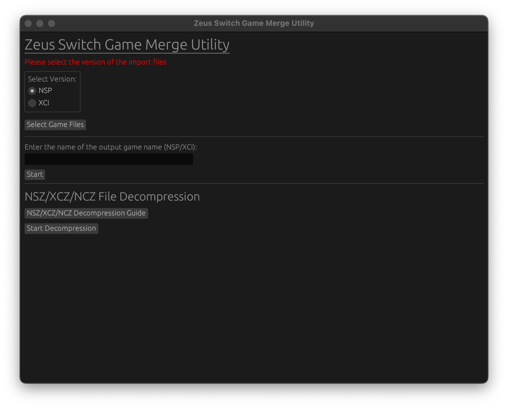

# Switch Game Merger Utility

The purpose of this project is to merge NSP & XCI files into a single file.

Occassionally if you have a NSP or XCI file that is split into multiple parts, you may want to merge or combine them.

This is a graphical program (written in Rust) designed to handle that process for you.



---

## Initial Launch (MacOS)
MacOS has a security feature where it will not execute unsigned (didn't pay for apple dev software) binaries/compiled code.

This is normal MacOS behvavior. If you launch the `zeus-switch-game-merge-utility` and it complains about it not being compatible, this is the issue.

Run these commands in terminal for good measure:

*NOTE: You will need to navigate to the directory of the unzipped folder. Use the cd "foldername" command to get there if needed. ChatGPT is your friend here.*

```
xattr -dr com.apple.quarantine zeus-switch-game-merge-utility
xattr -dr com.apple.quarantine nsz
```

**I don't want to do this:** Check out the section regarding running from source. This will work around the issue since you are compiling the program youself.

## Compatability

Current supported operating system(s):

* MacOS (Silicon)
* Linux

**NOTE: There are plans for a Windows build. Working out the kinks.**

---

## Installation:

Visit the releases page, and get the current version for your system.

---

**RUNNING FROM SOURCE**

You will need rust installed. This is often a one-liner terminal command which is on the front page of their website.

*Check their official website: https://www.rust-lang.org/tools/install*

* Clone the Repo with Git
* Navigate inside the repo
* Run `cargo run` to have the program launch.

**Example**
```
git clone https://github.com/LordZeuss/switch-merge-utility
cd switch-merge-utility
cargo run
```

This compiles the program in real-time, eliminating any issues with MacOS security, or if you are running a different system (such as an Intel Mac).

---

## Usage

To use the program, simply launch the downloaded program.

* Select if your game files you are going to merge are NSP or XCI.
* Click `Select Game Files` and choose all of the NSP/XCI files to be merged.
* Enter a output name - WITHOUT the .nsp or .xci extension (EX: My Merged Files)
* Click `Start`

The program will say "Finished!" when completed, and the file will be in the same directory as the program.

There is no need to add .nsp or .xci when entering the name, as the program will do this for you.

### NSZ/XCZ/NCZ Decompression Guide

On MacOS, you will need to place the prod.key in your home directory, in a .switch directory.

It will look like this:

/Users/MY_USERNAME_HERE/.switch/prod.keys

Without the prod.keys, you cannot decompress NSZ files.

NSZ decompressor is the https://github.com/nicoboss/nsz utility compiled to a portable binary with pyinstaller. All credit goes to them for creating this tool.

You will need the _internal directory and the NSZ file in the same directory as the program in order for it to work.
---

## FAQ

Q: Will this run on Intel based Macs?
A: I'm not sure - don't have one to test. I know the precompiled binaries won't work, but you should be able to clone the repo and run it from rust natively and I believe it will work. It's not doing anything special under the hood.

Q: Will this run on M series Macs?
A: Yes. I built this program primarily for my M3 Macbook, however it will run on all M series silicon Macs.

Q: Will this patch NSP/XCI File Updates?
A: No. There is some magic that other tools use that I haven't figured out how it works. This tool is primarily for taking split files and merging it into complete file.

Q: How does it work?
A: I am essentially doing a copy command from multiple files into one new file. It's truly nothing special, I just wanted to make a UI for it and maybe someone will find it useful. More of a fun Rust project than anything.
